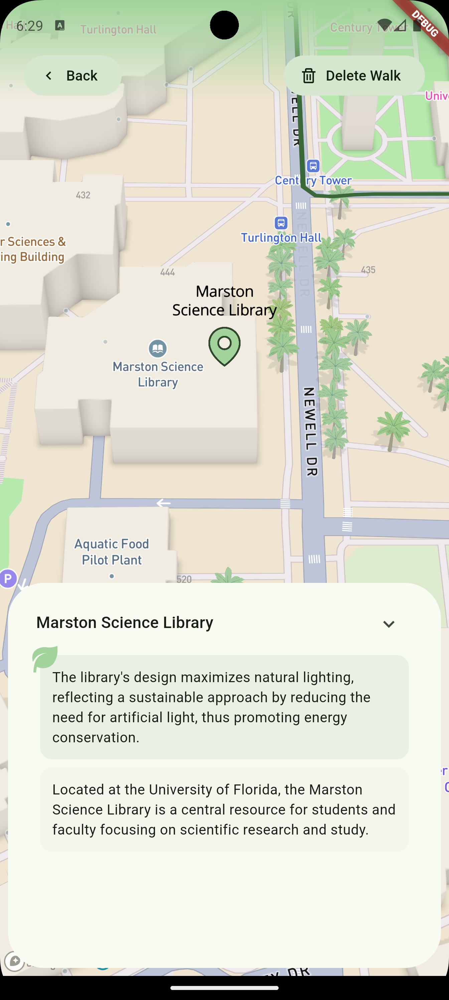
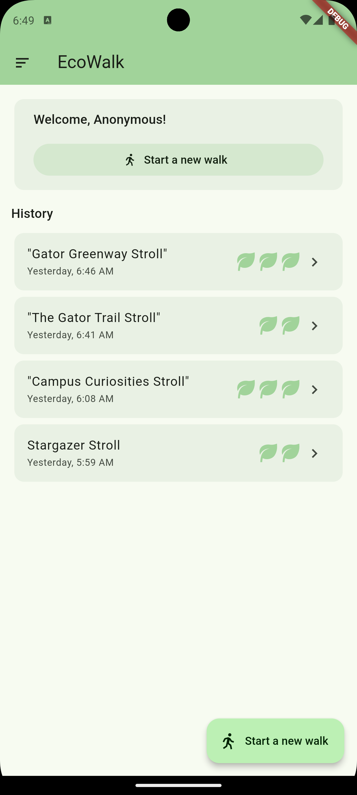
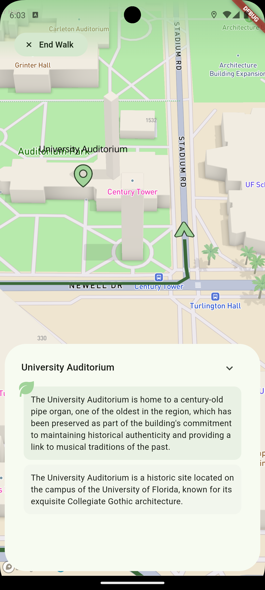
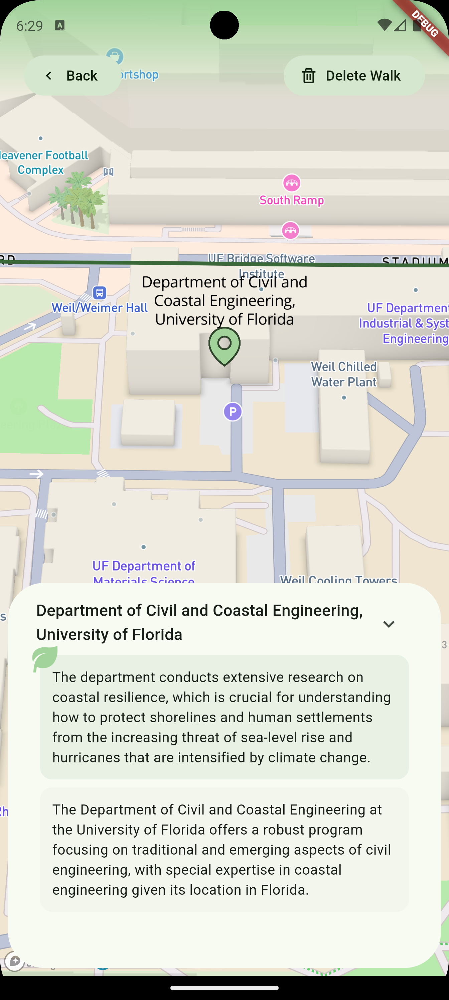

# EcoWalk

EcoWalk is an innovative walking tracker app designed to promote environmental awareness and encourage users to engage with the world around them. By combining fitness tracking with educational opportunities, EcoWalk helps users discover and learn about environmentally significant landmarks while earning rewards for their curiosity and exploration.

---

## 🌱 Features

### 🚶 Real-Time Walking Tracker
- **Dynamic Map Tracking**: Follow your real-time position on an interactive map as you walk. A path is drawn to visualize your journey, making it easy to see where you’ve been.

### 🌍 Discover Environmental Landmarks
- **Landmark Detection**: At random intervals during your walk, EcoWalk queries the Google Places API to identify nearby points of interest.
- **AI-Powered Insights**: Leveraging OpenAI’s assistant API, the app determines if any landmarks are environmentally significant. If so, it provides:
  - Informative descriptions about the landmark.
  - Fun and educational environmental facts.

### 🍃 Reward System
- Earn "Leaf Points" for discovering environmentally significant places during your walks.
- Points motivate continued exploration and environmental learning.

### 🗺️ Post-Walk Insights
- **Walk Review**: After completing a walk, scrub through your journey to revisit all the landmarks you discovered and the facts you learned.
- **Lifetime History**: View a summary of all your past walks on the home page, including:
  - Total distance traveled.
  - Number of leaf points earned per walk.
  - Lifetime leaf point total.

---

## 🎯 Why EcoWalk?

EcoWalk is more than just a walking tracker — it’s a tool for:
- **Promoting Environmental Awareness**: By highlighting significant locations, users gain a better understanding of their local environment.
- **Encouraging Fitness**: With rewards and progress tracking, users stay motivated to keep walking.
- **Gamified Learning**: The leaf point system adds a fun, competitive element while educating users about the environment.

---

## 🛠️ Tech Stack

### Frontend
- [**Flutter**](https://flutter.dev/): For building a cross-platform mobile experience.

### Backend
- [**Firebase**](https://firebase.google.com/): To store user walk history, leaf points, and progress data.
- [**Google Cloud Functions**](https://cloud.google.com/functions/): Server-side logic and API integration.

### APIs Used
- [**Mapbox SDK**](https://www.mapbox.com/): For displaying the map.
- [**Google Places API**](https://developers.google.com/maps/documentation/places): To identify nearby landmarks.
- [**OpenAI API**](https://openai.com/api/): For generating environmental insights about landmarks.

---

## 🚀 How It Works

1. **Start a Walk**: Open the app and start tracking your walk. The map updates in real-time to show your position and the path you’ve taken.
2. **Discover Landmarks**: At intervals, the app checks for nearby points of interest using the Google Places API. If a significant landmark is detected, you’re notified and presented with information and an environmentally significant fun fact.
3. **Earn Leaf Points**: For each significant landmark you find, you earn points that are tracked in your profile.
4. **Review Your Journey**: After ending your walk, explore a detailed summary of your route and revisit the landmarks you encountered.
5. **Track Your Progress**: Check the home page to view your walking history and lifetime achievements.

## 📚 Future Enhancements

- **Social Features**: Share your walks and environmental achievements with friends.
- **Custom Challenges**: Set personalized walking goals and earn badges.
- **Leaderboard**: Compete with other users based on leaf points earned.
- **AR Integration**: Use augmented reality to enhance the experience of discovering landmarks.

---

## 💡 Inspiration

EcoWalk was inspired by the desire to combine fitness, education, and environmental stewardship into a single engaging experience. We hope to create a community of walkers who not only care about their health but also the health of the planet.

---

## 🎨 Demo Screenshots

[**Video Showcase**](https://youtu.be/LuHYYhurqic)

---

### 🌟 Let’s Walk, Learn, and Grow Together with EcoWalk!

